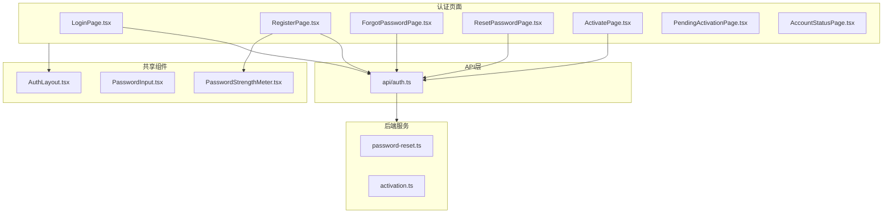

# Week 3 - 前端认证界面开发计划

## 任务概览

| ID | 任务 | 工期 | 依赖 ||----|------|------|------|| 4.2.6 | 前端登录界面（重新设计） | 3天 | Week 2 完成 || 4.2.7 | 前端注册界面 | 2天 | 4.2.6 || 4.2.9 | 找回密码功能 | 2天 | 4.2.8（邮件服务） || 4.2.10 | 账户激活功能 | 2天 | 4.2.8（邮件服务） || 4.2.17 | 账户状态提示界面 | 1天 | 4.2.6 |

## 架构设计




## 实现方案

### 1. 共享组件 (Day 1)

**新增文件**:

- [`frontend/src/components/auth/AuthLayout.tsx`](frontend/src/components/auth/AuthLayout.tsx) - 认证页面统一布局
- [`frontend/src/components/auth/PasswordInput.tsx`](frontend/src/components/auth/PasswordInput.tsx) - 带显示/隐藏的密码输入
- [`frontend/src/components/auth/PasswordStrengthMeter.tsx`](frontend/src/components/auth/PasswordStrengthMeter.tsx) - 密码强度指示器

### 2. 登录页面重构 (Day 1-2)

**修改文件**: [`frontend/src/pages/LoginPage.tsx`](frontend/src/pages/LoginPage.tsx)改进点:

- 使用 AuthLayout 统一布局
- 支持用户名/邮箱/手机登录
- 添加"记住我"功能
- 根据账户状态显示不同错误（pending/disabled/locked/expired）
- 添加"忘记密码"和"注册"链接

### 3. 注册页面 (Day 2-3)

**新增文件**: [`frontend/src/pages/RegisterPage.tsx`](frontend/src/pages/RegisterPage.tsx)功能:

- 表单字段：用户名、邮箱、手机（可选）、密码、确认密码
- 实时凭证唯一性校验（调用 `/api/auth/validate-credential`）
- 密码强度指示器
- 根据系统设置决定注册后跳转

### 4. 找回密码功能 (Day 3-4)

**新增文件**:

- [`frontend/src/pages/ForgotPasswordPage.tsx`](frontend/src/pages/ForgotPasswordPage.tsx) - 输入邮箱
- [`frontend/src/pages/ResetPasswordPage.tsx`](frontend/src/pages/ResetPasswordPage.tsx) - 设置新密码
- [`backend/src/services/password-reset.ts`](backend/src/services/password-reset.ts) - Token 管理

**后端 API**:

```typescript
POST /api/auth/forgot-password  // 发送重置链接
POST /api/auth/reset-password   // 重置密码
GET  /api/auth/verify-reset-token/:token  // 验证Token有效性
```


### 5. 账户激活功能 (Day 4-5)

**新增文件**:

- [`frontend/src/pages/PendingActivationPage.tsx`](frontend/src/pages/PendingActivationPage.tsx) - 等待激活提示
- [`frontend/src/pages/ActivatePage.tsx`](frontend/src/pages/ActivatePage.tsx) - 激活确认页面
- [`backend/src/services/activation.ts`](backend/src/services/activation.ts) - 激活Token管理

**后端 API**:

```typescript
POST /api/auth/send-activation  // 发送/重发激活邮件
POST /api/auth/activate         // 激活账户
GET  /api/auth/verify-activation-token/:token  // 验证Token
```


### 6. 账户状态页面 (Day 5)

**新增文件**: [`frontend/src/pages/AccountStatusPage.tsx`](frontend/src/pages/AccountStatusPage.tsx)根据状态显示不同内容:

- `pending` - 提示激活 + 重发链接
- `disabled` - 联系管理员
- `locked` - 显示解锁时间或联系管理员
- `expired` - 提示续期

### 7. 更新路由和API

**修改文件**:

- [`frontend/src/App.tsx`](frontend/src/App.tsx) - 添加新路由
- [`frontend/src/api/auth.ts`](frontend/src/api/auth.ts) - 添加新API函数
- [`frontend/src/stores/auth-store.ts`](frontend/src/stores/auth-store.ts) - 扩展状态管理
- [`backend/src/api/auth.ts`](backend/src/api/auth.ts) - 添加新端点

## 路由配置

```typescript
/login                    - 登录
/register                 - 注册
/forgot-password          - 找回密码
/reset-password/:token    - 重置密码
/pending-activation       - 等待激活
/activate/:token          - 激活账户
/account-status/:status   - 账户状态提示
```


## 涉及文件汇总

| 文件 | 类型 ||------|------|| `frontend/src/components/auth/AuthLayout.tsx` | 新增 || `frontend/src/components/auth/PasswordInput.tsx` | 新增 || `frontend/src/components/auth/PasswordStrengthMeter.tsx` | 新增 || `frontend/src/pages/LoginPage.tsx` | 重写 || `frontend/src/pages/RegisterPage.tsx` | 新增 || `frontend/src/pages/ForgotPasswordPage.tsx` | 新增 || `frontend/src/pages/ResetPasswordPage.tsx` | 新增 || `frontend/src/pages/PendingActivationPage.tsx` | 新增 || `frontend/src/pages/ActivatePage.tsx` | 新增 || `frontend/src/pages/AccountStatusPage.tsx` | 新增 || `frontend/src/api/auth.ts` | 修改 || `frontend/src/stores/auth-store.ts` | 修改 || `frontend/src/App.tsx` | 修改 || `backend/src/services/password-reset.ts` | 新增 || `backend/src/services/activation.ts` | 新增 || `backend/src/api/auth.ts` | 修改 |

## UI 设计原则

- 使用统一的 AuthLayout 保持一致性
- 深色渐变背景 + 白色卡片
- 响应式设计适配移动端