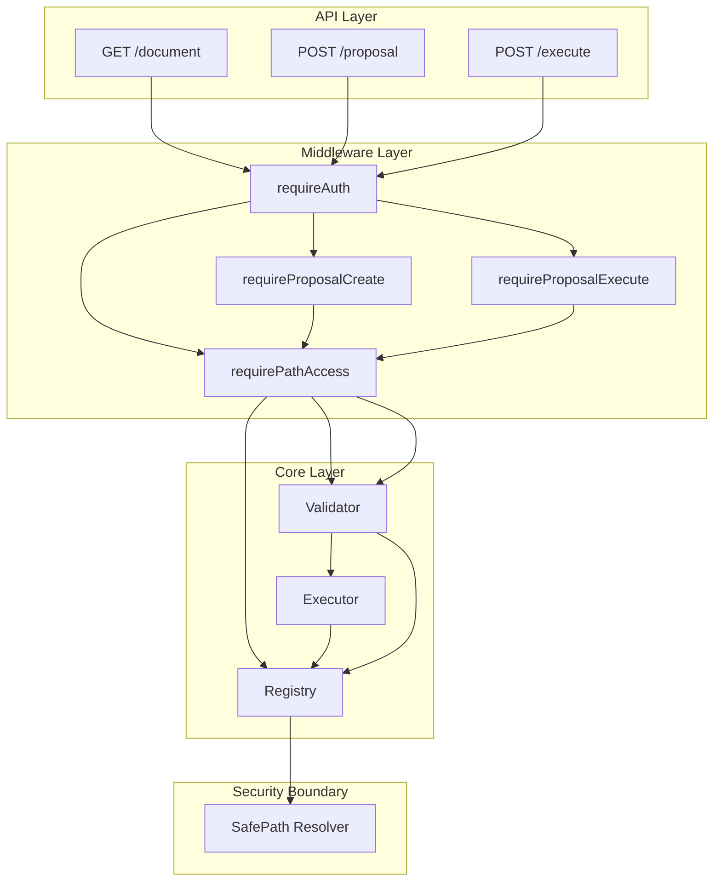

# Phase 2: 范式落地

> 有了"宪法"，现在要建立"警察"和"法院"

---

## 问题诊断

Phase 1.5 的核心意图是把系统从"若干功能模块 + 文档存储"校正为：
- Workspace Index 负责"发现与索引"
- Registry 负责"宇宙唯一真理源（路径许可）"
- Query 负责"定位（Handle），而不是搬运数据"
- Proposal 负责"写入缓冲（可审计）"
- Executor 负责"原子落盘 + Commit"

**核心问题**：范式写在注释里了，但没有在架构上被强制执行。

### P0 级硬伤

1. **路径穿透风险** - `workspace-registry.ts` 直接 `join(repositoryRoot, relativePath)`，无任何边界检查
2. **权限系统未接入** - `adl.ts` 所有路由无权限中间件，`index.ts` 只用了 `optionalAuth`
3. **Executor 绕开 Registry** - `executor.ts` 接收 `repositoryRoot` 参数，直接操作文件

### P1 级问题

1. **blocks index 可能泄露 machine 内容** - 索引存储过多数据
2. **YAML dump 格式漂移** - 需要明确策略
3. **Workspace Index 缓存没有一致性策略** - 外部变更时缓存不失效

---

## Phase 2 架构目标

---

## 实施计划

### 1. 路径边界硬化 (P0-1)

**目标**: Registry 成为安全边界的唯一守门人

**修改文件**: `backend/src/services/workspace-registry.ts`

**实现内容**:
- 新增 `SafePathResult` 接口和 `resolveSafePath()` 函数
- 拒绝绝对路径、路径穿越（..）、URL 编码绕过、软链接
- 所有入口（`documentExists`、`resolveDocument`、`getDocument`）必须先过 SafePath

### 2. Executor 改用 DocumentHandle (P0-3)

**目标**: Executor 不再接收裸路径，只接受 Registry 生成的 Handle

**修改文件**: `backend/src/adl/executor.ts`、`backend/src/adl/validator.ts`

**实现内容**:
- 移除 `repositoryRoot` 参数
- 通过 `resolveDocument()` 获取文档句柄
- 使用 `getSafeAbsolutePath()` 获取安全的绝对路径

### 3. 权限真正接入 (P0-2)

**目标**: 读需要可见域检查，写需要提案权限检查

**修改文件**: `backend/src/api/adl.ts`、`backend/src/api/workspace.ts`

**权限矩阵**:

| 端点 | 中间件 | 说明 |
|------|--------|------|
| `GET /document` | `requireAuth` + `requirePathAccess` | 读需要路径可见性 |
| `GET /block/:anchor` | `requireAuth` + `requirePathAccess` | 同上 |
| `POST /proposal` | `requireAuth` + `requireProposalCreate` + `requirePathAccess` | 创建需要提案权限 |
| `POST /proposal/:id/execute` | `requireAuth` + `requireProposalExecute` | 执行需要执行权限 |
| `POST /query` | `requireAuth` | Query 结果需按可见域过滤 |
| `GET /workspace/*` | `requireAuth` | 按可见域过滤 |

### 4. Index 去数据库化 (P1-1)

**目标**: blocks.json 只存定位信息，不存 machine 全量数据

**修改文件**: `backend/src/services/query-service.ts`

**实现内容**:
- `BlockIndexEntry` 只保留：`anchor`、`document`、`heading`、`title`、`type`、`status`、`searchable`
- 不再存储 `machine` 全量数据
- 过滤只支持 `searchable` 白名单字段

### 5. 缓存一致性策略 (P1-3)

**目标**: workspace.json 能检测外部变更

**修改文件**: `backend/src/services/workspace-service.ts`

**实现内容**:
- `WorkspaceIndex` 增加 `repo_head` 和 `stale` 字段
- `rebuildWorkspaceIndex()` 时保存当前 Git HEAD
- `getWorkspaceIndex()` 时检查 repo_head 是否与当前一致

---

## 验收标准

- [x] 任何包含 `..` 或绝对路径的请求被 Registry 拒绝
- [x] 未登录用户无法读取任何文档
- [x] Client 用户只能看到授权路径下的文档
- [x] Query 结果自动按用户可见域过滤
- [x] Executor 不再接收 `repositoryRoot` 参数
- [x] blocks.json 中不再存储 `machine` 全量数据
- [x] E2E 测试覆盖路径穿透、权限拒绝、可见域过滤场景

---

## 不做清单

- 不引入复杂的 RBAC 系统
- 不做 YAML patch 级编辑（Phase 3）
- 不做实时文件监听（Phase 3）
- 不做多仓库支持

---

## 完成状态

Phase 2 已完成，所有 P0 级安全硬伤已修复：

1. **SafePath 解析器** - 所有路径访问必须经过安全验证
2. **权限中间件全面接入** - 所有 API 路由都有权限检查
3. **Executor 通过 Registry** - 不再接收裸路径参数
4. **Index 去数据库化** - 只存储最小定位信息
5. **缓存一致性** - 可检测索引是否过期

---

## Phase 2.1 补丁（范式强制执行）

### 缺陷 A 修复：Query-service 全面改为 Registry 取路径

**问题**: `rebuildBlocksIndex()` 直接拼接 `repositoryRoot + path`，绕开了 Registry。

**修复**: 
- 使用 `documentExists()` 检查文档存在性
- 使用 `getDocument()` 获取文档内容
- 新增 `updateBlocksIndexForDocument()` 增量更新函数

### 缺陷 B 修复：SafePath realpath 前缀校验

**问题**: 只检查目标文件是否为 symlink，未检查路径链路中的目录 symlink。

**修复**:
- 使用 `realpathSync()` 获取真实路径
- 比较 `realFullPath` 与 `realRepoRoot` 的前缀关系
- 检测 symlink 链路逃逸攻击

### 缺陷 D 修复：BlocksIndex 增量更新

**问题**: 每次 Proposal 执行后全量重建索引，规模化时会成为性能死穴。

**修复**:
- 新增 `updateBlocksIndexForDocument(docPath)` 函数
- Proposal 执行后只更新受影响的文档条目
- 保留 `rebuildBlocksIndex()` 用于手动全量重建

E2E 测试脚本：`backend/scripts/phase2-e2e.ts`

