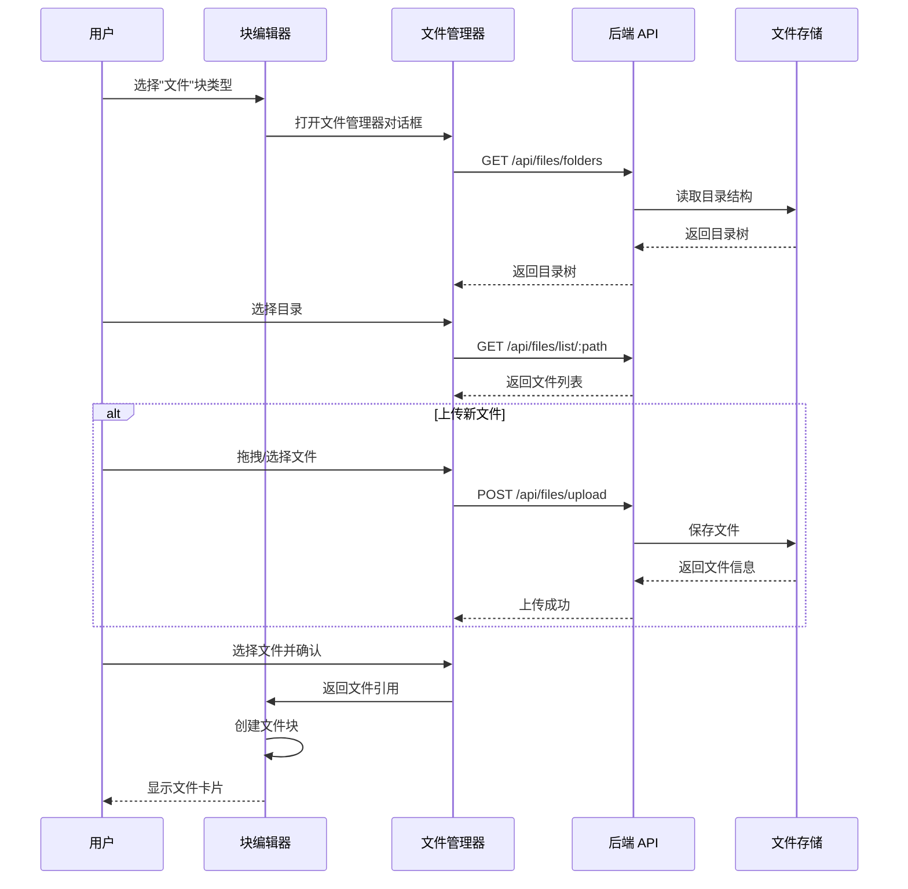

# Phase 3.9: 文件管理组件

> **代号**: File Manager Component  
> **目标**: 为文档编辑器引入文件管理能力，用户可以上传、组织和引用文件资源

## 背景与动机

### 当前痛点

在 Phase 3.8 中，我们实现了可视化文档编辑器，支持多种块类型（段落、标题、代码、数据块等）。但目前缺少对文件资源的管理能力：

- 用户无法在文档中引用本地文件（合同扫描件、发票 PDF、产品图片等）
- 没有统一的文件存储和组织方式
- 文件与文档的关联关系不明确

### 业务场景

| 场景 | 需求 |
|-----|------|
| **客户管理** | 附加合同扫描件、营业执照副本 |
| **项目管理** | 关联设计稿、需求文档、会议录音 |
| **知识库** | 嵌入参考资料、技术文档、教程视频 |
| **财务管理** | 附加发票、收据、银行流水 |

### 设计理念

> **"文件是文档的一部分，而不是外部附件。"**

传统的"附件"模式将文件与文档割裂。我们的目标是让文件成为文档内容的有机组成部分，可被引用、预览和搜索。

---

## 功能规划

### Phase 3.9.1 - 文件块类型

在块编辑器中新增"文件"块类型：

```
块类型菜单
├── 段落
├── 标题 1/2/3
├── 列表
├── 代码
├── 数据块
└── 📎 文件  ← 新增
```

**文件块的行为**：
1. 选择"文件"类型后，打开文件管理器对话框
2. 用户选择或上传文件
3. 确认后，文件引用插入到文档中
4. 在编辑器中显示文件预览卡片

### Phase 3.9.2 - 文件管理器组件

核心 UI 组件，提供完整的文件管理能力：

```
┌─────────────────────────────────────────────────────────────┐
│  📁 文件管理器                                        ✕ │
├─────────────────────────────────────────────────────────────┤
│  ┌──────────────────┐  ┌─────────────────────────────────┐  │
│  │ 📁 文件夹        │  │ 当前目录: /客户资料/合同/       │  │
│  │ ├─ 📁 客户资料   │  ├─────────────────────────────────┤  │
│  │ │  ├─ 📁 合同    │◀│ 📄 合同模板.docx      2.3 MB   │  │
│  │ │  └─ 📁 发票    │  │ 📄 框架协议.pdf       1.1 MB   │  │
│  │ ├─ 📁 项目文档   │  │ 🖼️ 公章扫描件.png    256 KB   │  │
│  │ └─ 📁 素材库     │  │ 📄 保密协议.pdf       890 KB   │  │
│  │                  │  │                                 │  │
│  │ [+ 新建文件夹]   │  │ [📤 上传文件]                   │  │
│  └──────────────────┘  └─────────────────────────────────┘  │
├─────────────────────────────────────────────────────────────┤
│  已选择: 框架协议.pdf                    [取消] [确定插入]  │
└─────────────────────────────────────────────────────────────┘
```

**功能点**：

| 功能 | 说明 |
|-----|------|
| 目录树 | 左侧显示用户文件夹结构，支持展开/折叠 |
| 文件列表 | 右侧显示当前目录下的文件，支持排序 |
| 新建文件夹 | 在当前目录创建子文件夹 |
| 删除文件夹 | 删除空文件夹（非空需确认） |
| 上传文件 | 支持拖拽上传，多文件上传 |
| 删除文件 | 右键菜单或删除按钮 |
| 文件预览 | 图片/PDF 快速预览 |
| 搜索 | 按文件名搜索 |

### Phase 3.9.3 - 文件块渲染

文件引用在文档中的呈现方式：

**编辑模式**：
```
┌─────────────────────────────────────────────────────────────┐
│  📎  框架协议.pdf                                          │
│  ├─ 大小: 1.1 MB                                           │
│  ├─ 路径: /客户资料/合同/                                   │
│  └─ 上传于: 2026-01-03                                     │
│                                            [预览] [替换]    │
└─────────────────────────────────────────────────────────────┘
```

**阅读模式**：
- 图片：直接嵌入显示
- PDF：显示预览缩略图 + 下载链接
- 其他：显示文件卡片 + 下载链接

### Phase 3.9.4 - 后端文件服务

提供文件存储和管理的 API：

| 端点 | 方法 | 说明 |
|-----|------|------|
| `/api/files/folders` | GET | 获取用户文件夹树 |
| `/api/files/folders` | POST | 创建文件夹 |
| `/api/files/folders/:path` | DELETE | 删除文件夹 |
| `/api/files/list/:path` | GET | 列出目录内容 |
| `/api/files/upload` | POST | 上传文件（multipart） |
| `/api/files/:path` | GET | 获取/下载文件 |
| `/api/files/:path` | DELETE | 删除文件 |
| `/api/files/:path/preview` | GET | 获取预览（缩略图） |

---

## 技术架构

### 存储方案

```
workspace/
├── documents/        # 文档存储
│   └── *.md
└── files/            # 用户文件存储
    ├── 客户资料/
    │   ├── 合同/
    │   │   └── 框架协议.pdf
    │   └── 发票/
    ├── 项目文档/
    └── 素材库/
```

**设计决策**：
- 文件存储在 `workspace/files/` 目录下
- 支持用户自定义目录结构
- 文件名保持原始名称（处理冲突时加后缀）
- 大文件支持（限制单文件 50MB）

### 文件引用格式

在 Markdown 中的存储格式：

```markdown
<!-- 图片引用 -->


<!-- 文件引用（使用自定义语法） -->
```file
path: /客户资料/合同/框架协议.pdf
name: 框架协议.pdf
size: 1126400
type: application/pdf
uploaded: 2026-01-03T10:30:00Z
```

<!-- 或使用 YAML 数据块 -->
```yaml
type: file_reference
path: /客户资料/合同/框架协议.pdf
display_name: 框架协议
```
```

### 组件架构

```
frontend/src/components/visual-editor/
├── FileManager/
│   ├── index.ts                    # 导出
│   ├── FileManagerDialog.tsx       # 主对话框
│   ├── FolderTree.tsx              # 文件夹树组件
│   ├── FileList.tsx                # 文件列表组件
│   ├── FileUploader.tsx            # 上传组件
│   ├── FilePreview.tsx             # 预览组件
│   ├── FileCard.tsx                # 文件卡片（用于文档内渲染）
│   └── types.ts                    # 类型定义
└── BlockEditor/
    └── types.ts                    # 新增 'file' 块类型
```

---

## 数据流设计



---

## UI/UX 设计

### 文件管理器对话框

**布局**：
- 宽度：80% 视口宽度，最大 1000px
- 高度：60% 视口高度，最小 500px
- 左侧目录树占 30%，右侧文件列表占 70%

**交互**：
- 双击文件夹进入
- 单击文件选中
- 双击文件确认插入
- 拖拽文件到对话框上传
- 右键菜单：重命名、删除、下载

### 文件块卡片

**样式**：
- 圆角边框，轻微阴影
- 左侧显示文件图标（根据类型）
- 中间显示文件名和元信息
- 右侧显示操作按钮

**支持的预览类型**：
| 文件类型 | 预览方式 |
|---------|---------|
| 图片 (jpg/png/gif/webp) | 直接嵌入 |
| PDF | 首页缩略图 |
| Office 文档 | 文件图标 |
| 视频 (mp4/webm) | 视频播放器 |
| 音频 (mp3/wav) | 音频播放器 |
| 其他 | 通用文件图标 |

---

## 安全考虑

### 文件类型限制

**允许上传**：
- 文档：pdf, doc, docx, xls, xlsx, ppt, pptx, txt, md
- 图片：jpg, jpeg, png, gif, webp, svg
- 音视频：mp3, wav, mp4, webm
- 压缩包：zip, rar, 7z

**禁止上传**：
- 可执行文件：exe, bat, sh, cmd
- 脚本文件：js, ts, py（除非在代码目录）
- 系统文件：dll, so, dylib

### 路径安全

- 路径遍历攻击防护（禁止 `..`）
- 文件名消毒（移除特殊字符）
- 权限检查（用户只能访问自己的文件）

### 文件大小限制

- 单文件最大：50MB
- 总存储配额：可配置（默认 1GB）

---

## 实施计划

| 阶段 | 任务 | 预计工作量 |
|-----|------|-----------|
| 3.9.1 | 文件块类型定义 | 1h |
| 3.9.2 | 后端文件服务 API | 4h |
| 3.9.3 | 文件管理器组件 | 6h |
| 3.9.4 | 文件上传与下载 | 3h |
| 3.9.5 | 文件块渲染 | 2h |
| 3.9.6 | 预览功能 | 2h |
| 3.9.7 | 测试与优化 | 2h |
| **总计** | | **20h** |

---

## 文件变更清单（预估）

### 后端

| 文件 | 变更类型 | 说明 |
|-----|---------|------|
| `backend/src/api/files.ts` | 新增 | 文件管理 API 路由 |
| `backend/src/services/file-service.ts` | 新增 | 文件服务（CRUD） |
| `backend/src/index.ts` | 修改 | 注册文件路由、multipart 中间件 |

### 前端

| 文件 | 变更类型 | 说明 |
|-----|---------|------|
| `frontend/src/api/files.ts` | 新增 | 文件 API 客户端 |
| `frontend/src/components/visual-editor/FileManager/` | 新增 | 文件管理器组件目录 |
| `frontend/src/components/visual-editor/BlockEditor/types.ts` | 修改 | 添加 file 块类型 |
| `frontend/src/components/visual-editor/BlockEditor/BlockItem.tsx` | 修改 | 渲染文件块 |
| `frontend/src/components/visual-editor/BlockEditor/parser.ts` | 修改 | 解析文件块 |

---

## 扩展规划

### Phase 3.9+ 可能的扩展

1. **文件版本控制**：支持文件多版本，查看历史
2. **文件标签**：为文件添加标签，便于分类
3. **全文搜索**：对 PDF/文档内容进行索引和搜索
4. **在线编辑**：集成 Office Online 或 OnlyOffice
5. **协同分享**：生成文件分享链接
6. **云存储集成**：支持 S3、OSS 等云存储

---

## 参考

- [Notion File & Media](https://www.notion.so/help/files-and-media)
- [Obsidian Attachments](https://help.obsidian.md/Files+and+folders/Manage+attachments)
- [React Dropzone](https://react-dropzone.js.org/)
- [Multer - Node.js middleware](https://github.com/expressjs/multer)

---

## 更新记录

| 版本 | 日期 | 内容 |
|-----|------|------|
| v0.1 | 2026-01-03 | 初始规划文档 |

