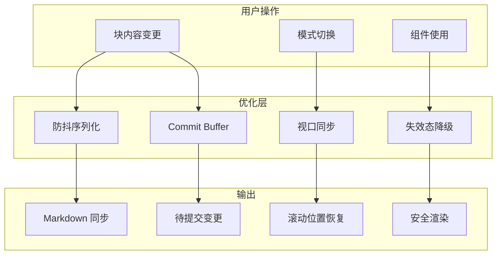

# Phase 3.8.9: 编辑器稳健性与性能优化

> 基于代码审阅反馈，提升编辑器的性能、用户体验和系统可信度。

## 概述

本阶段聚焦四项核心优化：

| 优化项 | 优先级 | 状态 |
|-------|--------|------|
| C. 失效态降级体验 (Iron Rule 3) | P0 | ✅ |
| A. 渲染性能防抖优化 | P1 | ✅ |
| B. 视口同步（模式切换位置保持） | P2 | ✅ |
| D. Commit Buffer 提案机制 | P3 | ✅ |

---

## A. 渲染性能与防抖优化

### 问题

当前 `updateBlocks` 每次调用都会触发 `blocksToMarkdown` 全量序列化，大文档时高频输入会掉帧。

### 解决方案

引入 `use-debounce` 库，实现：
1. 延迟 300ms 后再触发 `onChange` 序列化
2. 块失焦时立即 flush
3. 保存前强制同步

### 代码实现

**文件**: `frontend/src/components/visual-editor/BlockEditor/BlockEditor.tsx`

```typescript
// 防抖序列化：延迟 300ms 后再触发 onChange
const debouncedSerialize = useDebouncedCallback((newBlocks: Block[]) => {
    onChange(blocksToMarkdown(newBlocks));
}, 300);

// 立即同步（用于保存前或块失焦时）
const flushSerialize = useCallback(() => {
    debouncedSerialize.flush();
}, [debouncedSerialize]);

const updateBlocks = useCallback((newBlocks: Block[]) => {
    setBlocks(newBlocks);
    debouncedSerialize(newBlocks);
}, [debouncedSerialize]);

// 块失焦时立即同步
const handleBlockBlur = useCallback(() => {
    flushSerialize();
}, [flushSerialize]);
```

### 接口扩展

```typescript
export interface BlockEditorRef {
    getContent: () => string;
    setContent: (content: string) => void;
    focus: () => void;
    /** 获取当前选中的块 ID（用于视口同步） */
    getSelectedBlockId: () => string | null;
    /** 立即同步内容（跳过防抖） */
    flushContent: () => void;
}
```

---

## B. 视口同步（模式切换位置保持）

### 问题

用户在源码模式修改了某个深层区块后，切回可视化模式时，往往会丢失当前的阅读位置。

### 解决方案

1. 模式切换前保存当前 `selectedBlockId`
2. 为每个 BlockItem 添加 `id` 属性用于 DOM 定位
3. 切回编辑模式时，通过 `scrollIntoView` 自动定位

### 代码实现

**文件**: `frontend/src/components/visual-editor/VisualDocEditor.tsx`

```typescript
// 视口同步：记录最后选中的块 ID
const [lastBlockId, setLastBlockId] = useState<string | null>(null);

// 模式切换处理
const handleViewModeChange = useCallback((newMode: ViewMode) => {
    if (viewMode === 'edit' && blockEditorRef.current) {
        const currentId = blockEditorRef.current.getSelectedBlockId?.();
        if (currentId) {
            setLastBlockId(currentId);
        }
        blockEditorRef.current.flushContent?.();
    }
    setViewMode(newMode);
}, [viewMode]);

// 切回编辑模式时恢复滚动位置
useEffect(() => {
    if (viewMode === 'edit' && lastBlockId) {
        const timer = setTimeout(() => {
            document.getElementById(`block-${lastBlockId}`)?.scrollIntoView({
                behavior: 'smooth',
                block: 'center'
            });
        }, 100);
        return () => clearTimeout(timer);
    }
}, [viewMode, lastBlockId]);
```

**文件**: `frontend/src/components/visual-editor/BlockEditor/BlockItem.tsx`

```typescript
// 添加 id 属性用于定位
<div
    id={`block-${block.id}`}
    ref={setNodeRef}
    // ...
>
```

---

## C. 失效态降级体验 (Iron Rule 3)

### 问题

当组件定义不存在时，当前只显示普通输入框，不符合"系统永远可信"原则。

### 解决方案

在 `ComponentControls.tsx` 中添加 `FallbackControl` 组件，当绑定的组件不存在时：
1. 显示警告信息
2. 显示原始数据
3. 提供手动输入能力
4. 提示用户组件可能已被删除

### 代码实现

**文件**: `frontend/src/components/visual-editor/BlockEditor/ComponentControls.tsx`

```typescript
/**
 * 组件不可用时的降级渲染
 */
export function FallbackControl({
    componentId,
    value,
    onChange,
}: FallbackControlProps) {
    return (
        <div className="p-3 bg-amber-50 border border-amber-200 rounded-lg">
            <div className="flex items-center gap-2 text-amber-700 mb-2">
                <AlertTriangle size={16} />
                <span className="font-medium text-sm">组件不可用</span>
            </div>
            <div className="text-xs text-amber-600 mb-2">
                组件 ID: <code className="bg-amber-100 px-1 rounded">{componentId}</code>
            </div>
            {typeof value === 'object' && value !== null && (
                <div className="text-xs bg-white p-2 rounded border font-mono overflow-auto max-h-24 mb-2">
                    {JSON.stringify(value, null, 2)}
                </div>
            )}
            <input
                type="text"
                value={String(value ?? '')}
                onChange={(e) => onChange(e.target.value)}
                className="flex-1 text-xs px-2 py-1 border border-amber-200 rounded"
                placeholder="手动输入值..."
            />
            <p className="text-[10px] text-amber-500 mt-2">
                该字段绑定的组件未找到，可能已被删除或来自未导入的模板。
            </p>
        </div>
    );
}
```

**文件**: `frontend/src/components/visual-editor/BlockEditor/DataBlockEditor.tsx`

```typescript
) : boundComponent ? (
    // 组件存在，渲染组件控件
    <ComponentControl ... />
) : boundComponentId ? (
    // 绑定存在但组件定义不存在 - 失效态降级 (Iron Rule 3)
    <FallbackControl
        componentId={boundComponentId}
        value={field.value}
        onChange={(newValue) => updateFieldValue(index, newValue)}
    />
) : (
    // 无绑定，普通输入框
    <input ... />
)
```

---

## D. Commit Buffer 提案机制

### 问题

用户的微操作（改颜色、拖拽）立即触发状态变更，缺乏事务性。

### 解决方案

引入 Commit Buffer，批量收集变更，显式提交。这与 Phase 3.0 定义的"提案机制"对齐。

### 代码实现

**新增文件**: `frontend/src/components/visual-editor/hooks/useCommitBuffer.ts`

```typescript
export interface PendingChange {
    id: string;
    type: 'field' | 'block' | 'component' | 'structure' | 'property';
    description: string;
    timestamp: number;
    apply: () => void;
    revert: () => void;
}

export function useCommitBuffer(): CommitBufferResult {
    const [pendingChanges, setPendingChanges] = useState<PendingChange[]>([]);

    const addChange = useCallback((change: CreateChangeParams) => {
        setPendingChanges(prev => [...prev, {
            ...change,
            id: `change-${Date.now()}-${Math.random().toString(36).slice(2, 7)}`,
            timestamp: Date.now(),
        }]);
    }, []);

    const commitAll = useCallback(() => {
        pendingChanges.forEach(c => c.apply());
        setPendingChanges([]);
    }, [pendingChanges]);

    const discardAll = useCallback(() => {
        [...pendingChanges].reverse().forEach(c => c.revert());
        setPendingChanges([]);
    }, [pendingChanges]);

    return { pendingChanges, addChange, commitAll, discardAll, ... };
}
```

### UI 集成

底部状态栏显示待提交变更：

```tsx
{hasPendingChanges && (
    <div className="flex items-center gap-2 px-2 py-1 bg-amber-50 border border-amber-200 rounded">
        <Clock size={12} className="text-amber-600" />
        <span className="text-amber-700">{pendingCount} 项待提交变更</span>
        <button onClick={commitAll}>提交</button>
        <button onClick={discardAll}>放弃</button>
    </div>
)}
```

---

## 文件变更清单

| 文件 | 变更类型 | 说明 |
|-----|---------|------|
| `frontend/package.json` | 修改 | 添加 `use-debounce` 依赖 |
| `frontend/src/components/visual-editor/BlockEditor/BlockEditor.tsx` | 修改 | 防抖序列化、暴露 getSelectedBlockId、flushContent |
| `frontend/src/components/visual-editor/BlockEditor/BlockItem.tsx` | 修改 | 添加 DOM id、onBlur 回调 |
| `frontend/src/components/visual-editor/BlockEditor/ComponentControls.tsx` | 修改 | 新增 FallbackControl |
| `frontend/src/components/visual-editor/BlockEditor/DataBlockEditor.tsx` | 修改 | 集成 FallbackControl |
| `frontend/src/components/visual-editor/BlockEditor/index.ts` | 修改 | 导出 FallbackControl |
| `frontend/src/components/visual-editor/VisualDocEditor.tsx` | 修改 | 视口同步、Commit Buffer 集成 |
| `frontend/src/components/visual-editor/hooks/useCommitBuffer.ts` | 新增 | Commit Buffer Hook |
| `frontend/src/components/visual-editor/hooks/index.ts` | 修改 | 导出 useCommitBuffer |

---

## 架构图



---

## 未来扩展

1. **Commit Buffer 深度集成**: 将 `addChange` 通过 Context 传递给子组件，实现细粒度的变更跟踪
2. **变更预览**: 在提交前展示变更的 diff 视图
3. **撤销/重做**: 基于 Commit Buffer 实现操作历史
4. **协同编辑**: 将 Commit Buffer 与实时同步机制结合

---

## 更新记录

| 版本 | 日期 | 内容 |
|-----|------|------|
| v1.0 | 2026-01-03 | 初始版本，完成四项核心优化 |

